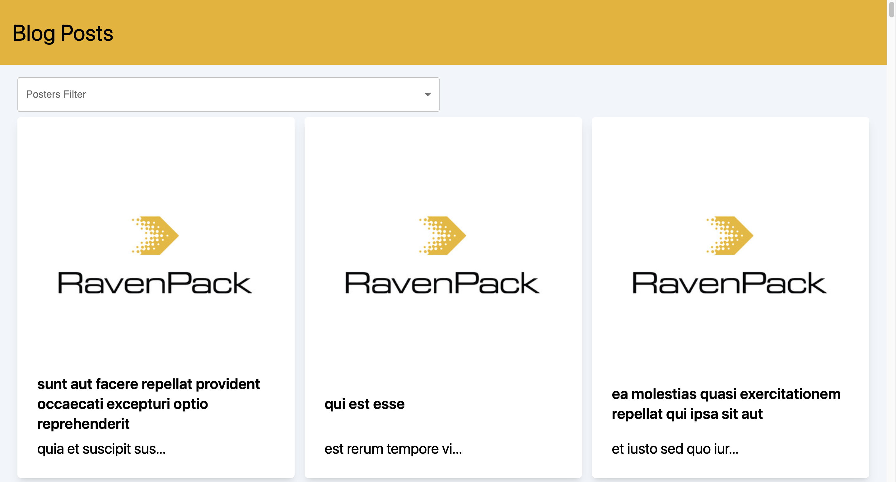
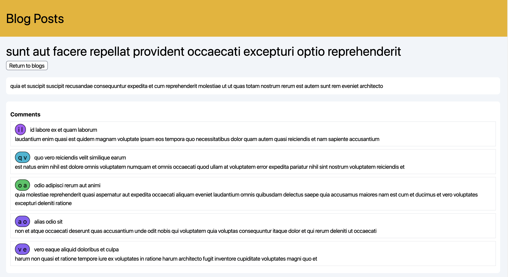
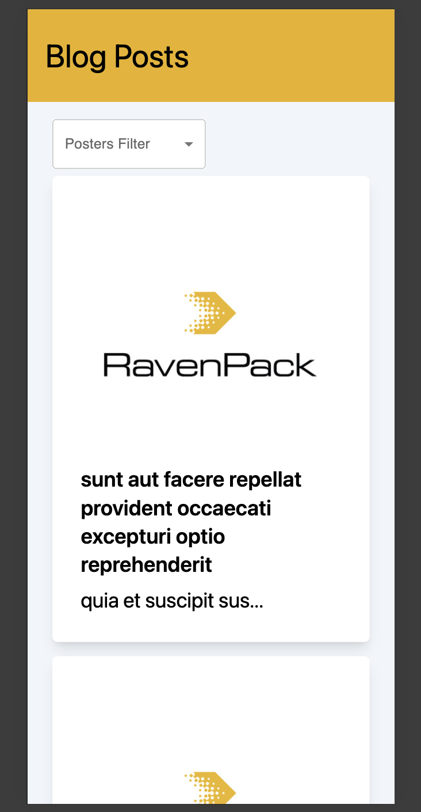
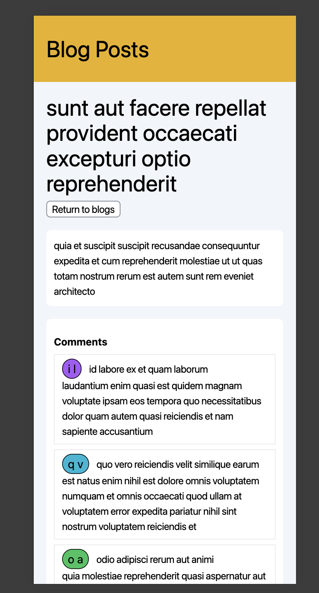

# Project title

Raven Pack: Frontend - Technical Challenge

# Table of Contents
1. [Project Description](#Description)
2. [Technologies used](#Technologies)
   
3. [How to run locally](#install)

# Project Description

 This task is a blog post reading application using React and JSONPlaceholder to get the data.

# Project Screenshots

	

# Technologies used

## JSONPlaceholder 
JSONPlaceholder is a publicly available API that provides various read-only endpoints, more information can be found on their website: https://jsonplaceholder.typicode.com/.

##  React with vite using TypeScript
React is the library for web and native user interfaces. Build user interfaces out of individual pieces called components written in JavaScript or Typescript (which it is in this project).

Vite is a local development server written by Evan You, the creator of Vue.js, and used by default by Vue and for React project templates. It has support for TypeScript and JSX. It uses Rollup and esbuild internally for bundling.

##  vitest and react testing library
These are the testing libraries used in the application to run these tests run the command 
`npm run test`

To learn more about vitest see [here](https://vitest.dev/)

To learn more about  react testing library see [here](https://testing-library.com/docs/react-testing-library/)

##  Tailwind CSS and MUI
Tailwind CSS is an framework.It differanting feature is it does not provide a series of predefined classes for elements such as buttons or tables.
To learn more about Tailwindcss see [here](https://tailwindcss.com/)

MUI is a suite of free UI tools to help new features faster to help bring designs system to our production-ready components.
To learn more about MUI see [here](https://mui.com/)

##  Tanstack query (React query) and axios
TanStack Query  (React query) helps gives you always-up-to-date auto-managed queries by making fetching, caching, synchronizing and updating server state in your web applications easier.
To learn more about MUI see [here](https://tanstack.com/query/latest)

Axios is a promise-based HTTP Client for node.js and the browser. It is isomorphic (= it can run in the browser and nodejs with the same codebase). On the server-side it uses the native node.js http module, while on the client (browser) it uses XMLHttpRequests. 

To learn more about Axios see
[here](https://axios-http.com/docs/intro)

##  Prettier and eslint
Prettier is an opinionated code formatter. It enforces a consistent style by parsing your code and re-printing it with its own rules that take the maximum line length into account, wrapping code when necessary.
To learn more about Prettier see
[here](https://prettier.io/)

ESLint is a static code analysis tool for identifying problematic patterns found in JavaScript code. It was created by Nicholas C. Zakas in 2013. Rules in ESLint are configurable, and customized rules can be defined and loaded. ESLint covers both code quality and coding style.

To learn more about ESLint see
[here](https://eslint.org/)

# How to install and run locally
  Clone the repository using:

   `git clone https://github.com/Patrick-Munnelly/raven-pack-frontend-tech-challenge.git`

  Go into the project folder in the terminal using 
  
  `cd ./raven-pack-frontend-tech-challenge`

  Next build the required node modules using:

  `npm install`

  Once the modiles are installed run the command:
  `npm run dev`
  Usually this will start the application on the port 5173 as long as you dont have another application running on that port  already the URL will be: 
  [http://localhost:5173/](http://localhost:5173/)

  You can also run unit tests using the command:
  `npm run test`

